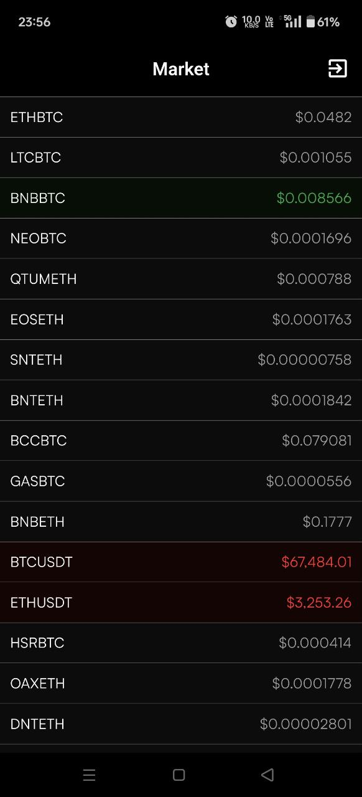
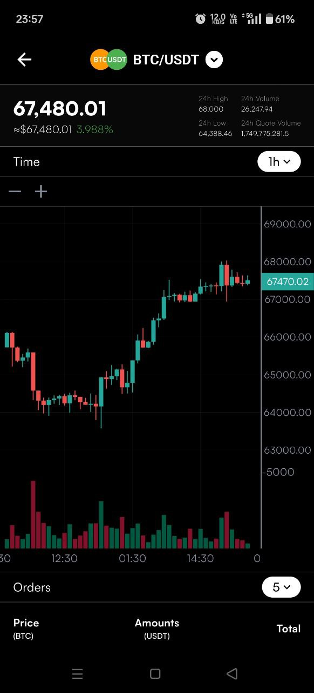
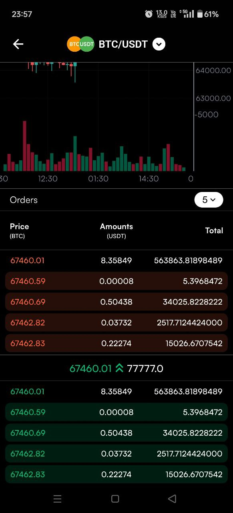

# TradeGlow

**TradeGlow** is a state-of-the-art application that offers real-time market data and detailed candle charts. Stay ahead of market trends with our intuitive, user-friendly interface designed for seamless navigation and in-depth analysis.

## Features

- **Real-Time Price Updates**: Instantly access the latest market data, updated in real-time.
- **Candle Charts**: Gain insights into market trends with detailed and comprehensive candle charts.
- **Order View**: Monitor and analyze order flows efficiently.
- **User-Friendly Interface**: Experience effortless navigation with our sleek and intuitive design.
- **Custom Alerts**: Set up personalized alerts to stay informed about significant market movements.

## Screenshot

  
  
  

## Demo 

  

## Technology

- **Binance API and Socket**: We leverage Binance API and socket to ensure reliable and accurate market data.
- **Provider**: We utilize the **Provider** package for efficient and effective data management, ensuring smooth and responsive updates.

## License

This project is licensed under the [MIT License](https://opensource.org/licenses/MIT). Feel free to modify and distribute it in accordance with the terms of the license.